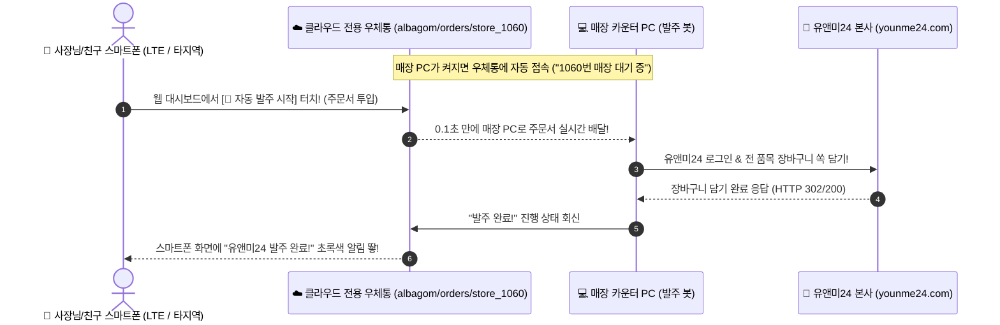

# 🏪 편의점 알바곤 (Alba-Gon)
> **알바는 폰으로 바코드만 삑삑 찍고, 사장님은 터치 한 번으로 유앤미24 본사 발주를 0.1초 만에 끝내는 전자동 편의점 재고/발주 시스템**

---

## 🌟 이런 분들을 위해 만들었습니다!
- 매주 월/목요일마다 유앤미24 사이트에 들어가서 **수십~수백 개 상품을 일일이 검색하고 수량 입력하느라 1~2시간씩 고생하셨던 사장님**
- 알바가 적어둔 재고 메모 보면서 장바구니 담다가 **주문 단위(박스/낱개) 헷갈려서 발주 실수하셨던 사장님**
- **집 침대에서든, 이동 중인 지하철에서든** 스마트폰 터치 한 번으로 매장 PC를 원격 조종해 유앤미 주문을 끝내고 싶으신 사장님

---

## 📱 스마트폰 접속 주소 (평생 무료 & 앱 설치 필요 없음)
👉 **[https://teelukira.github.io/alba-gon/](https://teelukira.github.io/alba-gon/)**
*(아이폰, 갤럭시, 태블릿, PC 등 인터넷 브라우저만 있으면 어디서나 바로 열립니다!)*

---

## 🏗️ 시스템 아키텍처: PC나 포스기가 바뀌어도 어떻게 찾아갈까?

> **"컴퓨터가 바뀌거나 포스기를 교체하면 IP 주소도 바뀔 텐데, 스마트폰이 그 바뀐 PC를 어떻게 알아채고 찾아갈까?"**

이 시스템은 컴퓨터의 집 주소(IP)를 직접 외우는 방식이 아니라, **인터넷 클라우드의 '전용 사서함(우체통)' 방식**으로 동작하기 때문에 PC가 바뀌어도 100% 자동으로 찾아갑니다.

### 📊 실시간 원격 발주 아키텍처 다이어그램



### 💡 전용 우체통 원리 핵심 요약
1. **IP 주소를 몰라도 됩니다:** 스마트폰은 매장 PC의 IP나 공유기 주소를 전혀 알 필요가 없습니다.
2. **가맹점 번호(`1060`)가 고유 우체통 주소입니다:** 클라우드 서버에 사장님 매장 번호표로 된 `store_1060` 우체통이 상시 열려 있습니다.
3. **PC를 바꿔도 즉시 자동 인식:** 
   - 새 컴퓨터에서 발주 봇(`2_웹앱연동_자동발주봇_실행.bat`)을 켜는 순간, 새 컴퓨터가 `store_1060` 우체통으로 출근 도장을 찍고 기다립니다.
   - 스마트폰이 우체통에 주문서를 넣으면, 새 컴퓨터가 0.1초 만에 낚아채서 유앤미로 발주를 넣습니다.
4. **다중 매장 완벽 분리 (친구 매장과 절대 섞이지 않음):**
   - 친구 매장 컴퓨터는 친구 가맹점 번호인 `store_2050` 우체통만 지키고 섭니다.
   - 사장님 매장 주문과 친구 매장 주문이 서로 완전히 분리되어 1건도 섞이지 않습니다.

---

## 🚀 딱 3단계! 컴퓨터 초보자를 위한 1분 설치 가이드 (처음 1번만!)

컴퓨터를 잘 모르셔도 괜찮습니다! 아래 순서대로 **딱 1번만** 따라 하시면 됩니다.

---

### [1단계] 무료 필수 프로그램 (Node.js) 설치하기 (30초)
발주 봇이 컴퓨터에서 일할 수 있게 해주는 필수 프로그램입니다.

1. 인터넷 주소창에 **https://nodejs.org/ko** 를 입력하고 들어갑니다.
2. 화면 중앙에 있는 **초록색 [LTS 버전]** 큰 버튼을 클릭해서 다운로드합니다.
3. 다운로드된 설치 파일(`node-v...-x64.msi`)을 더블클릭해 실행합니다.
4. 설치 창이 뜨면 고민하지 마시고 **[Next] ➡️ [Next] ➡️ [Next] ➡️ [Install]** 만 계속 누릅니다.
5. 설치가 끝나면 **[Finish]** 를 누르고, **컴퓨터를 한 번 껐다 켜주세요(다시 시작).**

---

### [2단계] 발주 프로그램 자동 설치 클릭 (10초)
1. 전달받은 프로그램 폴더(`alba-gon`)를 엽니다.
2. 폴더 안에 있는 **`[처음한번만실행]프로그램설치.bat`** 파일을 마우스로 **더블클릭**합니다.
3. 검은 창이 뜨면서 프로그램 부품들을 알아서 10초 만에 척척 설치해 줍니다!

---

### [3단계] 내 유앤미24 아이디 / 비밀번호 입력하기 (20초)
1. 2단계 설치가 끝나면 화면에 **메모장** 창이 자동으로 하나 뙇 열립니다.
2. 메모장 내용 중 사장님의 진짜 유앤미 아이디와 비밀번호를 적어주세요:
   ```env
   YOUNME_USER_ID=1060
   YOUNME_PASSWORD=사장님의_유앤미비밀번호
   ```
3. 메모장 상단 메뉴에서 **[파일] ➡️ [저장]** (또는 단축키 `Ctrl + S`)을 누르고 메모장을 닫습니다.

🎉 **축하합니다! 이제 모든 준비가 100% 끝났습니다!**

---

## 💼 매장에서 실제로 쓰는 법 (월/목 실전 루틴)

### 🏢 1. 매장 컴퓨터에서 할 일 (아침에 딱 1번)
- 매장 컴퓨터를 켜실 때, 폴더 안의 **`2_웹앱연동_자동발주봇_실행.bat`** 파일을 더블클릭합니다.
- 검은 창에 `🚀 [대기 상태] 원격 주문 대기 중...` 문구가 뜨면, **창을 닫지 마시고 오른쪽 위 최소화 버튼(_)을 눌러 아래로 내려두기만 하시면 끝**입니다!

---

### 📱 2. 알바가 할 일 (월/목 퇴근 전)
1. 매장 공용폰으로 **https://teelukira.github.io/alba-gon/** 접속 후 **[알바 모드]** 클릭
2. 매대를 돌며 부족한 상품 바코드를 카메라로 삑삑 스캔하고, 현재 매장에 남아있는 개수만 입력
3. 스캔이 끝나면 폰을 카운터에 내려놓고 기분 좋게 퇴근!

---

### 👑 3. 사장님이 할 일 (퇴근길 지하철, 집 침대 어디서든)
1. 스마트폰으로 **https://teelukira.github.io/alba-gon/** 접속 후 **[사장님 관리 대시보드]** 클릭 (기본 PIN: `1234`)
2. 알바가 찍어둔 재고를 바탕으로 시스템이 자동 계산한 **[추천 발주 수량]**을 훑어봅니다.
   *(더 시키고 싶거나 덜 시키고 싶은 것만 `+`, `-` 버튼으로 살짝 조절)*
3. 화면 맨 위 파란색 **[🚀 유앤미24 자동 발주 시작]** 버튼을 뙇 누릅니다!
4. **끝! 사장님이 하실 일은 이걸로 완료입니다.**
   - 매장 PC가 0.1초 만에 신호를 받아 유앤미24 사이트에 로그인하고,
   - 모든 품목을 장바구니에 쏙쏙 담아놓습니다.
5. 사장님은 나중에 유앤미 사이트에서 총 발주 금액만 눈으로 쓱 확인하시고 최종 **[발주 신청]**만 눌러주시면 끝납니다!

---

## 🛒 내 장바구니 눈으로 직접 확인해보고 싶을 때
- 내가 주문한 게 진짜 유앤미 사이트에 잘 들어갔는지 눈으로 보고 싶으실 때는:
- 매장 PC에서 **`1_유앤미_실제장바구니_확인.bat`** 을 더블클릭해 보세요!
- 진짜 크롬 브라우저가 눈앞에서 스르륵 열리면서 유앤미24에 로그인되고, 현재 담겨있는 장바구니와 금액 화면이 눈앞에 뙇 펼쳐집니다!

---

## ❓ 자주 묻는 질문 (FAQ)

### Q1. 다른 지역(집, 카페, LTE 상태)에서 주문 버튼을 눌러도 매장 PC가 주문을 넣어주나요?
**네, 100% 들어갑니다!**
보안 클라우드 실시간 릴레이 시스템이 탑재되어 있어, 사장님이 제주도에 계시든 지하철 LTE 상태이든 버튼을 누르면 0.1초 만에 매장 카운터 PC로 신호가 날아갑니다.

### Q2. 스마트폰이나 친구 폰에 VPN이나 테일스케일(Tailscale) 같은 앱을 깔아야 하나요?
**전혀 깔 필요가 없습니다!**
별도의 어플 설치 없이 그냥 카카오톡 링크 열듯이 일반 웹 브라우저로 접속하시면 됩니다.

### Q3. 매장 PC를 끄면 어떻게 되나요?
매장 PC가 꺼져 있으면 유앤미 사이트에 접속해 대신 장바구니를 채워줄 봇이 쉴 수밖에 없습니다. 따라서 발주를 넣으실 때는 **매장 카운터 PC를 켜두시고 `2_웹앱연동_자동발주봇_실행.bat` 창을 아래로 내려두셔야 합니다.**

### Q4. 내 유앤미 비밀번호가 인터넷이나 다른 사람에게 유출되지 않나요?
**절대 유출되지 않습니다!**
사장님의 비밀번호는 사장님의 개인 컴퓨터(`.env`) 안에만 보관되며, 깃허브(GitHub)나 외부 서버에는 1바이트도 전송되지 않도록 이중 보안 차단 장치가 적용되어 있습니다.

---

## 📞 파일 구성 안내
- **`[처음한번만실행]프로그램설치.bat`**: 처음 컴퓨터 세팅 시 더블클릭하는 자동 설치기
- **`2_웹앱연동_자동발주봇_실행.bat`**: 평소 매장 PC를 켜실 때 띄워두는 원격 발주 대기 봇 (가장 많이 씀!)
- **`1_유앤미_실제장바구니_확인.bat`**: 현재 유앤미 장바구니를 크롬 화면으로 열어보고 싶을 때 쓰는 확인기
- **`.env`**: 사장님의 유앤미 아이디와 비밀번호가 안전하게 보관되는 파일
